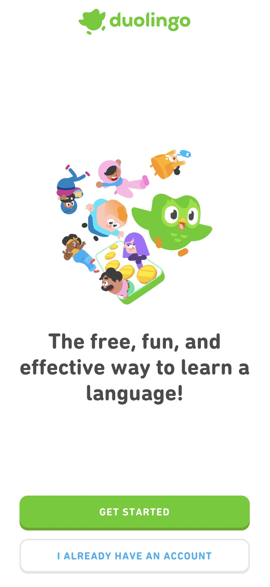
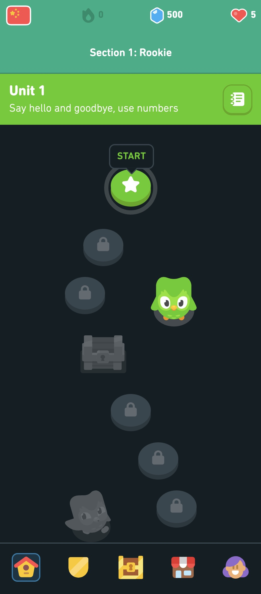

# Procesverslag
Markdown is een simpele manier om HTML te schrijven.  
Markdown cheat cheet: [Hulp bij het schrijven van Markdown](https://github.com/adam-p/markdown-here/wiki/Markdown-Cheatsheet).

Nb. De standaardstructuur en de spartaanse opmaak van de README.md zijn helemaal prima. Het gaat om de inhoud van je procesverslag. Besteedt de tijd voor pracht en praal aan je website.

Nb. Door *open* toe te voegen aan een *details* element kun je deze standaard open zetten. Fijn om dat steeds voor de relevante stuk(ken) te doen.

## Jij

  
uitwerken voor kick-off werkgroep

  ### Auteur:
  Filip Hensels

  #### Je startniveau:
  Rood

  #### Je focus:
  Surface Plane
  - Scroll animaties
  - Animaties
  - Dark mode
  - High contrast mode
  - Audio
  - Prefers reduced motion
 

## Je website

  
uitwerken voor kick-off werkgroep

  ### Je opdracht:
  Ik ga de website van <a href="https://duolingo.com/">Duolingo</a> namaken. De hoofdpagina en het hoofdmenu waar je de levels kan kiezen.

  #### Screenshot(s) van de eerste pagina (small screen): 
  Hoofdpagina  
  

  #### Screenshot(s) van de tweede pagina (small screen):
  Hoofdmenu met levels  
  
 

## Toegankelijkheidstest 1/2 (week 1)

  
uitwerken na test in 2e werkgroep

  ### Bevindingen
  Tijdens het invullen van de WCAG met de Duolingo website kwam er naar voren dat de website tekort kwam op erg veel vlakken. Deze staan hieronder beschreven.
  - Op de course pagina waar je een level kan starten had de HTML tag geen LANG attribuut.
  - Er is nergens een :focus style voor en ze hebben die van het OS uitgezet. Navigeren met de TAB-toets is dus onmogelijk.
  - Op de course pagina is de website zo goed als onbruikbaar in de horizontale oriëntatie op mobiel. De header en nav-bar nemen dan bijna alle ruimte in beslag.
  - Op de home pagina worden er meerdere H1 elementen gebruikt.
  - Sommige afbeeldingen missen een alt attribuut of benoemen niet alle tekst van de afbeelding in het alt attribuut.
  - Een "skip to content" link is niet zichtbaar tijdens het navigeren met de TAB-toets.
  - De website ondersteunt geen donkere modus.
  - Het contrast is niet hoog genoeg bij vrijwel alle tekst.
  - De website ondersteunt geen hoog contrast modus.
  - Het is niet mogelijk om tekst te selecteren.
  - De screenreader werkt wel, maar slaat decoratieve afbeeldingen niet over.

Deze bevindingen van de originele website van Duolingo valt er te zien dat er nog veel te verbeteren valt aan de website om het toegankelijker voor iedereen te maken.

## Breakdownschets (week 1)

  
uitwerken na afloop 3e werkgroep

  ### de hele pagina: 
  

## Voortgang 1 (week 2)

  
uitwerken voor 1e voortgang

  ### Stand van zaken
  Op dit moment gaat het erg goed, de eerste section van de homepage is af. Ik heb wel nog een beetje moeite met het zorgen voor de juiste witruimte overal. Ook weet ik nog niet hoe ik scroll-animaties moet toevoegen aan de header. Als laatste wil ik ook graag dat de eerste 2 knoppen altijd aan de onderkant van het scherm staan. Ik weet nog niet hoe ik dit mooi voor elkaar krijg.
  

  ### Agenda voor meeting

  | Constant       | Suzanne            | Filip        |
  | ---            | ---                | ---          |
  | Header         | Background image   | Paddings en witruimte   |
  | genres onder elkaar | Pagina in blokjes | Scroll animaties | 

  ### Verslag van meeting
  hier na afloop snel de uitkomsten van de meeting vastleggen

  - De witruimte hoeft niet tot op de pixel precies te zijn, maar moet wel zo veel mogelijk op het origineel lijken.
  - D.m.v. een grid krijg ik de knoppen op de onderkant.
  - Met behulp van een Intersection Observer in JavaScript krijg ik scroll animaties.

## Voortgang 2 (week 3)

  
uitwerken voor 2e voortgang

  ### Stand van zaken
  Deze week heb ik de homepage helemaal afgemaakt. Alleen moet ik de Scroll-animaties nog werkend krijgen, en heb ik bij de Learn anywhere, anytime section en boven de footer nog 2 SVG afbeeldingen over elkaar heen plaatsen en inzoomen zodat ze buiten zodat niet de hele breedte te zien is, maar breder wordt bij een breder scherm.

  

  ### Agenda voor meeting

  | Suzanne      | Constant         | Naomi    | Filip |
  | ---            | ---                | ---          | ---              |
  | vreemde witruimte oplossen  | Hulp met vragen         | Hulp met vragen    | Hulp met Intersection Observer    |
  | ... | ... | ... | Hulp met afbeelding buiten de pagina krijgen. |

  ### Verslag van meeting
  hier na afloop snel de uitkomsten van de meeting vastleggen

  - Ik hoef geen 2 SVG bestanden boven elkaar te zetten, maar kan deze gewoon samenvoegen in Illustrator.
  - Het is met uitleg van de studentassistent gelukt om deze ook goed te positioneren d.m.v. object fit en scale.
  - Intersection Observer is nog niet gelukt.

## Toegankelijkheidstest 2/2 (week 4)

  
uitwerken na test in 9e werkgroep

  ### Bevindingen
  In mijn website heb ik al aardig wat problemen opgelost die de originele website wel had met betrekking tot de WCAG checklist en toegankelijkheid:
  - Ik heb een :focus outline toegevoegd. Deze heb ik ook geanimeerd zodat die pulseert tussen wit en zwart zodat die altijd goed zichtbaar is. Deze animatie wordt niet afgespeeld bij de reduce motion preference.
  - Ik heb een skip to content button toegevoegd die in beeld komt als de focus er op staat.
  - Ik heb de HTML structuur verbeterd m.b.t. headings en geen enkel div of span element gebruikt.
  - Ik heb op beide pagina's een lege alt text toegevoegd bij decoratieve afbeeldingen. 
  - Ik heb de VoiceOver structuur logisch en duidelijk gemaakt op beide pagina's.

## Voortgang 3 (week 4)

  
uitwerken voor 3e voortgang

  ### Stand van zaken
  Beide pagina's zijn nu allebei zo goed als af, met uitzondering van een paar kleine details. Zo heb ik op de levels pagina een Start wolkje dat een driehoekje moet hebben zodat het lijkt op een tekstwolkje, maar dat driehoekje heb ik nog niet. Ook moet ik nog een aantal dingen voor de Surface plane doen, zoals een dark mode en een hoog contrast mode toevoegen.

  ### Agenda voor meeting
  samen met je groepje opstellen

  | Suzanne      | Naomi          | Constant    | Filip        |
  | ---            | ---                | ---          | ---              |
  | Animatie die buiten het beeld valt| ...| Screenreader verbeteren | Hoe je een tekstwolkje maakt    |
  | Skill animation | ...                | ...              | Pop-up wolkje |

  ### Verslag van meeting

  - Het is duidelijk hoe je het driehoekje van een tekstwolkje, namelijk met een lege ::after en met clip-path.
  - Duidelijk hoe je een zwevende animatie toe kan voegen aan dat tekstwolkje.

## Eindgesprek (week 5)

  
uitwerken voor eindgesprek

  ### Je uitkomst - karakteristiek screenshots:
  
  
  

  ### Dit ging goed/Heb ik geleerd: 
  Tijdens dit vak heb ik geleerd hoe je een website semantisch correct codeert met zo min mogelijk classes, divs en spans. Ook heb ik geleerd hoe je deze website zo goed mogelijk optimaliseert voor een screen reader. Over het algemeen ben ik tijdens dit vak een stuk beter geworden in HTML/CSS

  

  ### Dit was lastig/Is niet gelukt:
  De elementen waar ik JavaScript bij nodig had vond ik nog best wel lastig. Met name de intersection observer. Bij de learn anywhere, anytime section was het de bedoeling om daar een blauwe achtergrond aan toe te voegen die steeds blauwer werd, naarmate je verder scrollde. Ook zou de header uit beeld moeten verdwijnen bij die section en die daarna van Superduolingo. Het is mij helaas niet gelukt om dat zo te programmeren in JavaScript.

  

## Bronnenlijst

  
continu bijhouden terwijl je werkt

  Nb. Wees specifiek ('css-tricks' als bron is bijv. niet specifiek genoeg). 
  Nb. ChatGpT en andere AI horen er ook bij.
  Nb. Vermeld de bronnen ook in je code.

  1. ChatGPT voor hulp om mijn intersection observer werkend te krijgen en de scroll animatie uit te zetten bij de reduced motion preference.
  2. <a href="https://www.educative.io/answers/what-is-animate-scrolltop">Educative.io</a> voor de scroll animatie op de levels pagina.
  3. <a href="https://www.a11yproject.com/posts/how-to-hide-content/">a11yproject.com</a> voor de visually-hidden class gebruikt bij de Super Duolingo section op de homepage en de header op de levels page.

